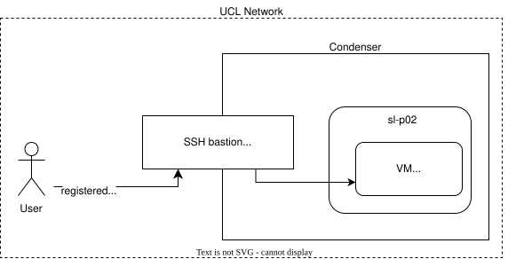

# Deploying with the Harvester GUI

We will deploy a virtual machine using the Harvester GUI. We will configure it for SSH access, and we will use Condenser's SSH bastion to log in to it.

All of the following instructions begin from the [Harvester dashboard for `sl-p02`](https://rancher.condenser.arc.ucl.ac.uk/dashboard/harvester/c/c-b5dbc/harvesterhci.io.dashboard).

This section requires an SSH key. If you do not have one, you can create one with `ssh-keygen`.

## Register your SSH key in Harvester

Navigate to: `Advanced > SSH Keys` and click **Create**.

Create a key resource in the `arc-devops-ns` namespace. Give it a unique name and furnish it with your public key data. If the form does not work, you can use the YAML format.

## Launch a VM

There are many configuration options for launching a VM. Here we will only call out what needs to be changed. If an option is not mentioned, you can assume that the default configuration is OK.

Navigate to the Virtual Machines tab. Click Create to get started.

Create the VM in the `arc-devops-ns` namespace and give it a unique name.

In the Basics tab:

- CPU: 1
- Memory: 8
- SSHKey: the key you registered in the previous step

In the Volumes tab:

- Image: harvester-public/almalinux-10-generic

In the Networks tab:

- Network: arc-devops-ns/default

Click create and wait for your VM to start. After about a minute your VM will be assigned an IP address.

## Log in to the VM with SSH

SSH access to VMs on Condenser is restricted by the SSH bastion at <ssh.condenser.ucl.ac.uk>.

> [!NOTE] Logging in to any virtual machine on Condenser actually requires two SSH keys; a key that is installed on the VM and a key that is registered with the SSH bastion. For this exercise, these keys are the same.



### Register your SSH key with the SSH bastion

In your browser, log in to the [SSH bastion](https://ssh.condenser.arc.ucl.ac.uk/).

Click on SSH Keys, then Upload your key. Enter the SSH public key data.

Then click on SSH Certificates. Sign a certificate and then follow the instructions to install it. Please be careful to check that:

- You have signed the correct key
- The key and cert files are in the correct locations
- The key and cert files have the correct permissions

You can test that your key is properly configured and signed with the following command:

``` sh
ssh -i ~/.ssh/id_ed25519 -o CertificateFile=~/.ssh/id_arc.signed cloud-user@ssh.condenser.arc.ucl.ac.uk
```

If your key and certificate are correctly set up the server will simply close the connection:

``` text
** WARNING: connection is not using a post-quantum key exchange algorithm.
** This session may be vulnerable to "store now, decrypt later" attacks.
** The server may need to be upgraded. See https://openssh.com/pq.html
------------------------------------------------------------
------------------------------------------------------------

Authorized uses only. All activity may be monitored and reported.

This system can only be used as a Jump (-J) or ProxyCommand host.

------------------------------------------------------------
------------------------------------------------------------
Connection to ssh.condenser.arc.ucl.ac.uk closed.
```

If they are not, you will recieve a permission denied message:

``` text
** WARNING: connection is not using a post-quantum key exchange algorithm.
** This session may be vulnerable to "store now, decrypt later" attacks.
** The server may need to be upgraded. See https://openssh.com/pq.html
------------------------------------------------------------
------------------------------------------------------------

Authorized uses only. All activity may be monitored and reported.

This system can only be used as a Jump (-J) or ProxyCommand host.

------------------------------------------------------------
------------------------------------------------------------
cloud-user@ssh.condenser.arc.ucl.ac.uk: Permission denied (publickey,gssapi-keyex,gssapi-with-mic).
```

You can record this host in your SSH config with the following entry:

``` ssh
Host condenser
  HostName ssh.condenser.arc.ucl.ac.uk
  User cloud-user
  CertificateFile ~/.ssh/id_arc.signed
  IdentityFile ~/.ssh/id_ed25519
```

Then to do the same test you would use:

``` sh
ssh condenser
```

### Log in to your VM by jumping through the bastion

Return to the Harvester GUI and check your VM's IP address. If your VM does not show an IP address, perform a soft restart action on it and wait for it to come back online. Then you can log in like so:

``` sh
ssh -J condenser -o StrictHostKeyChecking=no -o UserKnownHostsFile=/dev/null almalinux@<IP ADDRESS>
```

## Change VM state

You may have already restarted your VM. You can use various actions to stop and restart your VM. When you are finished, delete it.
