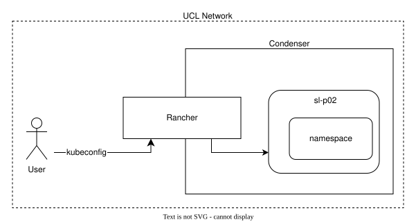

# Deploying with Terraform

## Write a terraform module

Create a new, empty directory and three empty files:

``` sh
mkdir terraform
cd terraform
touch main.tf terraform.tf variables.tf
```

Edit `terraform.tf` with your favourite text editor. Add the following text:

``` hcl
terraform {
  required_version = ">= 1.8.5"

  required_providers {
    harvester = {
      source  = "harvester/harvester"
      version = "1.7.0"
    }
  }
}
```

This file constrains the version of terraform required to run the module. It also constrains the version of the Harvester terraform provider.

Save the file, then edit `main.tf`. First add a block to specify the VM image:

``` hcl
data "harvester_image" "img" {
  display_name = "almalinux-10-generic"
  namespace    = "harvester-public"
}
```

Next add a block that describes the VM:

``` hcl
resource "harvester_virtualmachine" "vm" {
  name        = var.vm_name   # name of the VM resources in Harvester
  namespace   = var.namespace # namespace that the VM will be deployed in
  description = "Demo VM"
  hostname    = "demo"

  cpu    = 2
  memory = "16Gi"

  # useful settings which control how the VM boots and details about its resources
  restart_after_update = true
  efi                  = true
  secure_boot          = true
  run_strategy         = "RerunOnFailure"
  reserved_memory      = "100Mi"
  machine_type         = "q35"

  # The disk that the VM will boot from
  disk {
    name       = "rootdisk"
    type       = "disk"
    size       = "30Gi"
    bus        = "virtio"
    boot_order = 1

    image       = data.harvester_image.img.id
    auto_delete = true
  }

  # A required parameter; the name of the first network interface
  network_interface {
    name           = "eth0"
  }
}
```

Save this file. Finally, edit the `variables.tf` file. Here we will set up variables for the name of the VM and the namespace it should be deployed in.

``` hcl
variable "vm_name" {
  type        = string
  description = "Name of the VM"
}

variable "namespace" {
  type        = string
  description = "Namespace that the VM will be deployed in"
}
```

We can apply this deployment as-is. But first we need a kubeconfig file to authenticate to the cluster.

### Obtain a kubeconfig file

We are going to download our kubeconfig file, which Harvester requires to connect to the `sl-p02` cluster in Condenser.



To do so, return to the [Rancher GUI](https://rancher.condenser.arc.ucl.ac.uk/) in your web browser. Using the menu at left, go to **Virtualization Management**, and tick the box next to the cluster you need to authenticate to. For this workshop, we need `sl-p02`. Then click on **Download KubeConfig**. Take note of the location that your browser downloads the file to. Use your favorite method to move it to a handy location, such as the directory you've been working in.

``` sh
mv ~/Downloads/sl-p02.yaml .
```

For simplicity, we are going to use an environment variable to configure the Harvester terraform provider to use this kubeconfig file.

``` sh
export KUBECONFIG=$PWD/sl-p02.yaml
```

> [!WARNING]
> Your kubeconfig file contains a secret token that uses your credentials to authenticate to the Harvester cluster. Do not share it with anyone. If your kubeconfig file is compromised, delete the key from the [Account and API Keys](https://rancher.condenser.arc.ucl.ac.uk/dashboard/account) page in Rancher.

### Apply this deployment

First run `terraform init` to initialise the terraform module and download the Harvester provider:

``` sh
terraform init
```

Now run `terraform validate` to check that the configuration is valid, and then `terraform apply` to deploy the VM:

``` sh
terraform validate
terraform apply
> yes
```

You will be prompted for a name for the VM and the namespace to deploy it in. Use the `<WORKSHOP NAMESPACE>` for the namespace, and any unique name for the VM.

We can monitor the VM from the Harvester GUI. To do this, return to the [Rancher GUI](https://rancher.condenser.arc.ucl.ac.uk/) and navigate to `Virtualization Management > sl-p02 > Virtual Machines`. Click on the name of your VM to view its details. You can see the status of the VM, and if you click on the `Console` dropdown you can view the serial console output.

If we're quick, we can watch some of the boot process from the serial console.

However, this VM is not configured to expose a GUI of its own, nor is it configured for SSH access. So we have no way to log in and configure it to do anything. Lets destroy this VM and configure the deployment to provide SSH access.

``` sh
terraform destroy
> yes
```

## Configure a VM for SSH access

We will configure the VM to use a VLAN network and register an SSH public key.

Edit the `main.tf` file. Replace the `network_interface` block with the following configuration:

``` hcl
  network_interface {
    name           = "eth0"
    wait_for_lease = true
    type           = "bridge"
    network_name   = var.network_name
  }
```

This will enable the VM to use a pre-configured VLAN network.

Then insert this block to the `harvester_virtualmachine.vm` resource:

``` hcl
  cloudinit {
    user_data = <<EOF
#cloud-config
package_update: true
packages:
  - qemu-guest-agent
runcmd:
  - - systemctl
    - enable
    - --now
    - qemu-guest-agent.service
ssh_authorized_keys:
  - ${var.ssh_public_key_data}
power_state:
  mode: reboot
EOF
  }
```

The `cloudinit` block contains instructions that will configure the VM when it is launched.

Save the file. Then edit the `variables.tf` file; add two more variables:

``` hcl
variable "network_name" {
  type        = string
  description = "Name of a network in the namespace"
}

variable "ssh_public_key_data" {
  type        = string
  description = "SSH public key data"
}
```

Save the file, then create the `outputs.tf` file and add this block:

``` hcl
output "ip_address" {
  value = harvester_virtualmachine.vm.network_interface[0].ip_address
}
```

The VM will be assigned an IP address by DHCP. This output will retrieve that IP address.

Before we apply, we can use a `tfvars` file to record variable values instead of entering them when prompted. Create a new file named `terraform.tfvars` and populate it with the following data:

``` hcl
vm_name                = "<UNIQUE VM NAME>"
namespace           = "<WORKSHOP NAMESPACE>"
network_name        = "<WORKSHOP NAMESPACE>/default"
ssh_public_key_data = "<SSH PUBLIC KEY DATA>"
```

> [!NOTE]
> The `network_name` in the `network_interface` block is an ID with the form `NAMESPACE/NAME`. It's a bit of a misnomer.

Then deploy the configuration:

``` sh
terraform validate
terraform apply
> yes
```

> [!WARNING]
> Note that the cloud-init user data in this module is transmitted in plain text with no encryption. In general, do not use cloud-init user data to provision a VM with secrets. For alternatives, you can use Ansible to configure a VM with secrets, or Vault/OpenBao to use ephemeral secrets in Terraform.

The `ip_address` output will contain the IP address assigned via DHCP. If it is not immediately populated, run `terraform apply` again to retrieve the data from the cluster (it can take a few minutes for an IP address to be assigned).

Log in to the VM:

``` sh
ssh -J condenser -o StrictHostKeyChecking=no -o UserKnownHostsFile=/dev/null almalinux@<IP ADDRESS>
```

``` sh
terraform destroy
> yes
```

## Configure a VM for web ingress

We are going to configure the deployment to serve a website.

First we will configure cloudinit to start a simple web server.

Add `httpd` to the package installation list:

``` yaml
  - httpd
```

Then add a command to enable the service:

``` yaml
  - - systemctl
    - enable
    - --now
    - httpd
```

Then we need to add labels to the VM. Condenser has an ingress service which will look for these labels in projects with web ingress enabled.

Add this block to the `harvester_virtualmachine.vm` resource:

``` hcl
labels = {
    "condenser.ingress/isEnabled"      = true
    "condenser.ingress.demo/hostname"  = var.vm_name
  }
```

Deploy the configuration:

``` sh
terraform validate
terraform apply
> yes
```

Wait a few minutes, then check `https://<VM NAME>.<WORKSHOP PROJECT>.condenser.arc.ucl.ac.uk`.

## Using Terraform to enforce state

We are going to demonstrate the concept of "drift" and how Terraform can be used to enforce state.

Lets return to the [Rancher GUI](https://rancher.condenser.arc.ucl.ac.uk/) and modify the VM we deployed. We want to temporarily increase the amount of RAM available to the VM.

Navigate to: `Virtualization management > sl-p02 > Virtual Machines`

Click on your VM's name. Use the rain (overflow) menu in the upper right to **Edit Config**. Increase the RAM and save the changes. Your VM will need to restart for these to take effect.

After the changes are complete, return to the command line and run `terraform plan`. Terraform will detect that there have been changes to the VM and it will give you a plan to enforce the state specified in your deployment. You can then run `terraform apply` to make the planned changes and return the VM to its correct configuration.

If instead you wanted the change to be permanent, you can make the change in your terraform module and then `apply` it. This is a typical workflow for projects where multiple developers need to work on the infrastructure.

Lastly, we will demonstrate that some changes can be unintentionally destructive. Edit your `terraform.tfvars` file and change the name of the VM, then run `terraform plan`. Note that this change will force replacement of the VM.

## Back up deployment yaml files for the kubectl section

Finally, we are going to prepare for the next section by backing up the yaml files associated with this VM. Return to the [Rancher GUI](rancher.condenser.arc.ucl.ac.uk/) and navigate to your virtual machine. From the rain (overflow) menu in the upper right select **Download YAML**, and note the location where your browser downloads the file to. Use your favorite method to move it to a convenient location and re-name it to `webserver.yaml`.

``` sh
mv ~/Downloads/<VM NAME>.yaml ./webserver.yaml
```

## Destroy resources

Finally, destroy your webserver:

``` sh
terraform destroy
> yes
```

> [!WARNING]
> By default, Terraform state files are stored in plain text with no encryption. If you retrieve a secret from elsewhere and then use it in the module, it may be recorded in the state file. Hashicorp has written advice for [managing sensitive data in your Terraform configuration](https://developer.hashicorp.com/terraform/language/manage-sensitive-data).
